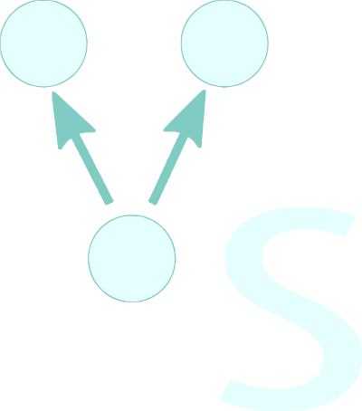

# Visual Structures 

## General Ideia

Visual Structures is a software capable of helping the development and visualization of data structures. The software is split in two parts. The first is a language that has the objective of discribind the data structure. The second is a visualizer that will run the functions defined by the language.

